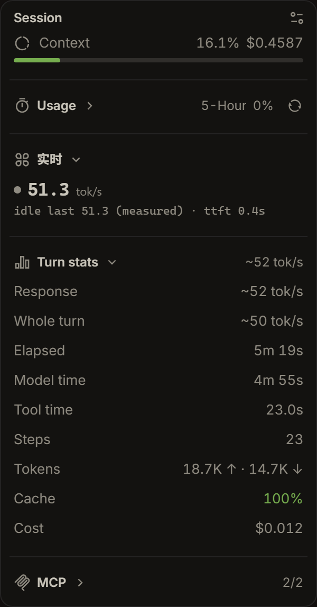

# Live TPS for OpenChamber

A `实时` section for the Work Status panel: live generation speed for the open
session, next to OpenChamber's own Turn stats.



## What it shows

- **Row 1** — instant `tok/s` with a sparkline and a state dot (generating /
  tool running / waiting for permission / waiting for an answer / idle). The
  rate divides buffered characters by the span they actually cover, so it reads
  correctly a couple of hundred milliseconds after streaming starts instead of
  climbing from 0. Streamed tool-call arguments count like text; tool *results*
  never count.
- **Row 2** — the last turn's average (`实测` when it comes from provider token
  counts, `估计` when it is a character estimate), this turn's time to first
  token, and a `无推理数据` note when the model reported no reasoning. A turn
  with nothing countable yet shows `进行中`.

Token, cache and cost totals are intentionally left to the native Turn stats.

## Accuracy

The average is built per assistant step, mirroring how OpenChamber's own turn
stats measure:

- Only spans with something countable contribute. A step whose start was never
  observed, whose duration is unmeasurable, or that settled zero tokens is left
  out rather than guessed at.
- Tool execution and waits for the user are removed from the denominator, so
  the headline locks instead of sliding while a tool runs.
- Character-to-token ratio starts at a default and is recalibrated from real
  settled token counts, with a clamp so one odd step cannot skew the meter.
- Every derived rate passes a plausibility ceiling. A span under a millisecond
  or a rate no provider reaches means the window is broken, not that the model
  was quick, and the meter reports nothing instead of a number it cannot
  defend. (A tool that outlasted everything generated before it used to collapse
  the reconstructed span to 1 ms and print over a hundred thousand tok/s.)

## Install

In **Settings → Extensions**, paste one of these into **Folder, ZIP, or URL**
and choose **Add**:

- the git URL of this repository (the only kind that can auto-update: bump
  `version` in `package.json`, push, and users get an **Update** button; add
  `#v1.2.0` to follow a tag instead of the default branch), or
- the absolute path of a local folder, for development.

Approve **Run a local service** when asked — the measurement runs in that
process. Then open the Work Status panel (`Choose sections`) and place `实时`
under Turn stats.

Requires OpenChamber `>= 2.0.4`. Extensions load on OpenChamber web and
desktop; VS Code and mobile do not load them.

## Remote instances

The status page reports the URL *it* was served from, but the service process
is spawned by the server that serves it. Those are the same machine locally,
and different machines when the desktop reaches an instance through an SSH
tunnel: the page then runs on `http://127.0.0.1:<tunnel>`, a loopback that does
not exist on the server, and the dial dies with `fetch failed`.

When that happens the service finds the server itself: it lists the ports its
parent (the OpenChamber server that spawned it) listens on — `netstat -ano` on
Windows, `ss -ltnp` on Linux, `lsof` on macOS — probes each for
`/api/global/event`, and attaches to the one that answers as an event stream.
The page's origin stays the fallback, so nothing changes for a local instance.

## How it works

```
status iframe --serviceRequest--> host --HTTP 127.0.0.1:port--> service process
                                                                   |
                                                                   +-- SSE /api/global/event
```

The service subscribes to the same OpenCode 2 event stream the OpenChamber UI
reads (`session.text.delta`, `session.reasoning.delta`, `session.step.ended`,
`session.execution.*`, tool and permission events) and derives the rates for
one watched session. The page never sees the service token and never dials the
port itself; everything goes through the host proxy.

## Build and test

```bash
bun install
bun run build      # status/main.js (IIFE) + panel/main.js + service/main.js (ESM)
bun run test       # mock SSE stream + the built service, ~56 assertions
```

OpenChamber never compiles an extension at install time, so **the built `*.js`
files are committed**. The smoke test drives the built service through
synthetic turns — measured rates, TTFT, tool and wait exclusion, late attach,
session memory, origin discovery — and is the regression net for the numbers
above.

## Layout

| Path | Role |
| --- | --- |
| `status/` | the `实时` section in the Work Status panel |
| `panel/` | the rail panel, same data with a larger sparkline |
| `service/` | the local process: event stream in, rates out |
| `shared/spark.ts` | sparkline helper used by both surfaces |
| `scripts/smoke.mjs` | mock event stream + assertions |
